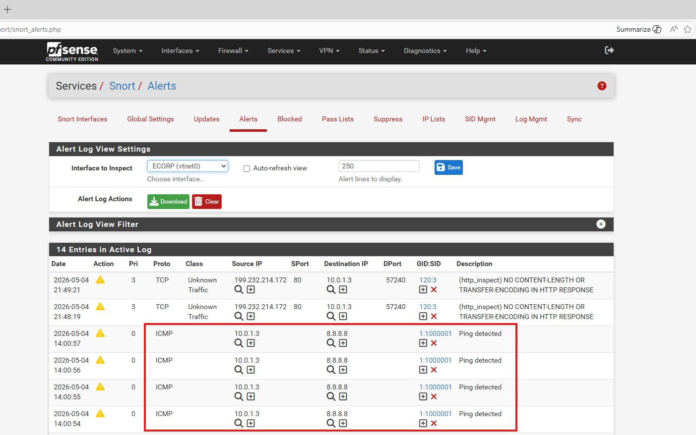
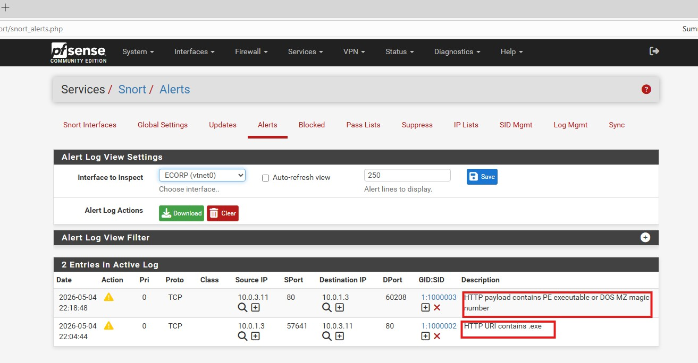

## IDS & IPS with Snort
This project configures Snort on pfSense to shift network defense from reactive to proactive. Custom rules detect URI indicators and binary "magic numbers," mitigating malware delivery and unauthorized ICMP recon in real-time.
### Lab Environment 
**IDS/IPS Engine** : Snort (Open source)

**Firewall Platform** : pfsense 

**Attack vector** : ICMP & HTTP Malware Delivery 

**Analysis Tools**  Kali linux (Payload generation), Window(Target), MSFVenom

### Phase Investigation
### Custom Rule Engineering & IDS Validation
- **Goal** Establish baseline visibility into unauthorized network reconnaissance and validate signature-based alert
- **Action** Define Custom ICMP detection rule within snort interface settings to monitor the `HOME_NET`
  - `alert icmp $HOME_NET any -> $EXTERNAL_NET any (msg:"Ping detected"; sid:1000001;)`
- **Discovery** Successfully identified outbound ICMP requests to external DNS (8.8.8.8) in the snort alert
  

### Advanced Signature Development (Heuristic Bypass Prevention)
- **Goal**: Detect malicious payloads even when attackers attempt to obfuscate file types via extension renaming like `.exe` or `.txt`
- **Action**: Engineered a deep-packet inspection (DPI) rule targeting the MZ Magic Number `(0x4D 0x5A)` within the first two bytes of the file data.
   - `alert tcp $EXTERNAL_NET 80 -> $HOME_NET any (msg:"HTTP payload contains PE executable"; file_data; content:"|4D 5A|"; depth:2; sid:1000003;)`
- **Discovery**: Identified a **Portable Executable**(PE) masquerading as a text file, proving that content based detection is superior to extension-based filtering.

